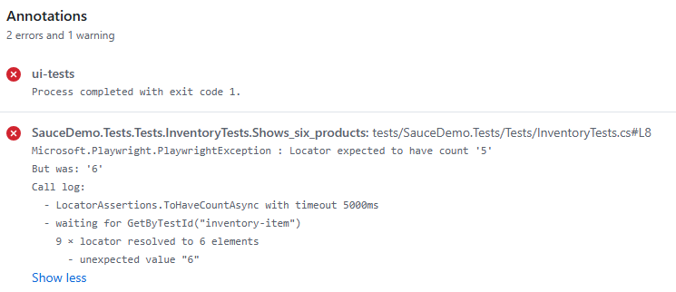
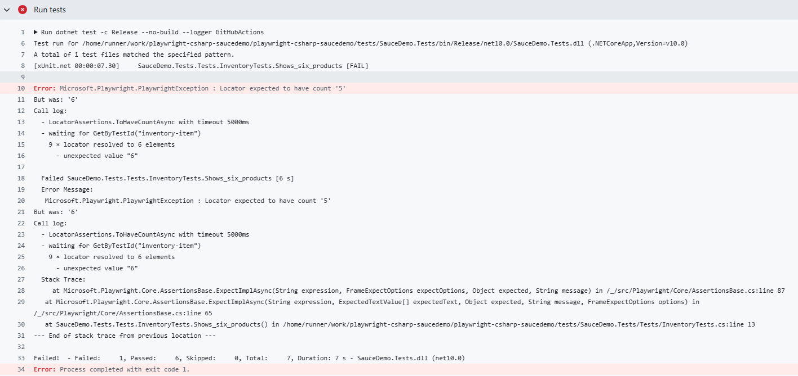
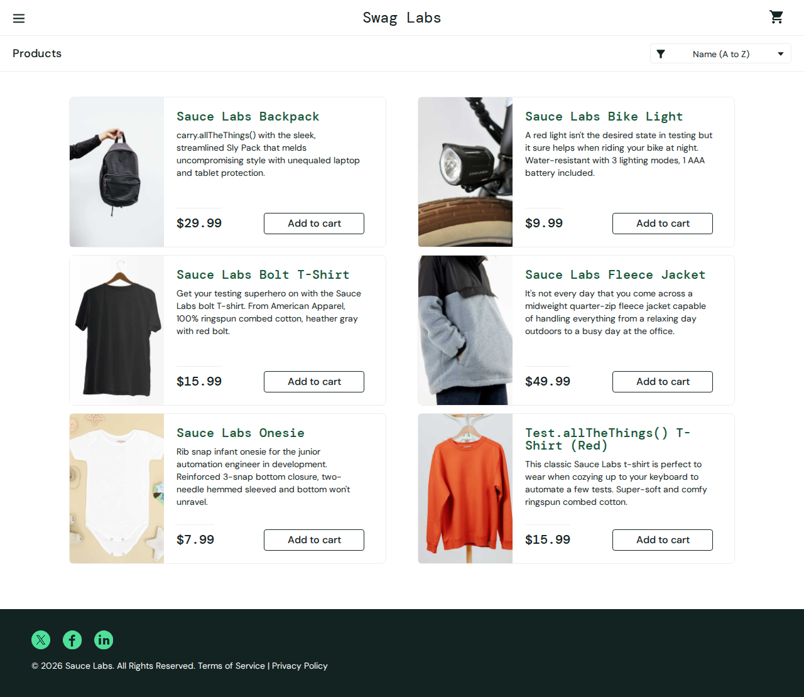

# Playwright C# UI tests

[](https://github.com/imaashishlk/playwright-csharp-saucedemo/actions/workflows/tests.yml)

A small UI test project for the demo shop [saucedemo.com](https://www.saucedemo.com),
written with C#, .NET 10, Playwright and xUnit. Tests run automatically in GitHub Actions.

## What it shows

- **Page Object pattern**: `LoginPage` and `InventoryPage` hold locators and actions, the tests hold the assertions.
- **7 tests**: login (valid, locked-out user, invalid credentials) and inventory (product list, cart badge).
- **Failure screenshots**: a failed test saves a full-page screenshot, uploaded as a GitHub Actions artifact.
- **CI**: every push builds the project, installs the browser and runs the tests.

## Failure reporting in action

When a test fails, GitHub Actions marks the run red and uploads a screenshot of the page as it looked at the moment of failure.

**Failed run with the error annotation**



**Screenshot uploaded as a build artifact**



**The screenshot itself**



## Project layout

```
.github/workflows/tests.yml   CI pipeline
tests/SauceDemo.Tests/
  Pages/     LoginPage, InventoryPage
  Support/   UiTestBase (opens the browser, screenshots on failure)
  Tests/     LoginTests, InventoryTests
```

## Run locally

```
dotnet build
pwsh tests/SauceDemo.Tests/bin/Debug/net10.0/playwright.ps1 install chromium
dotnet test
```